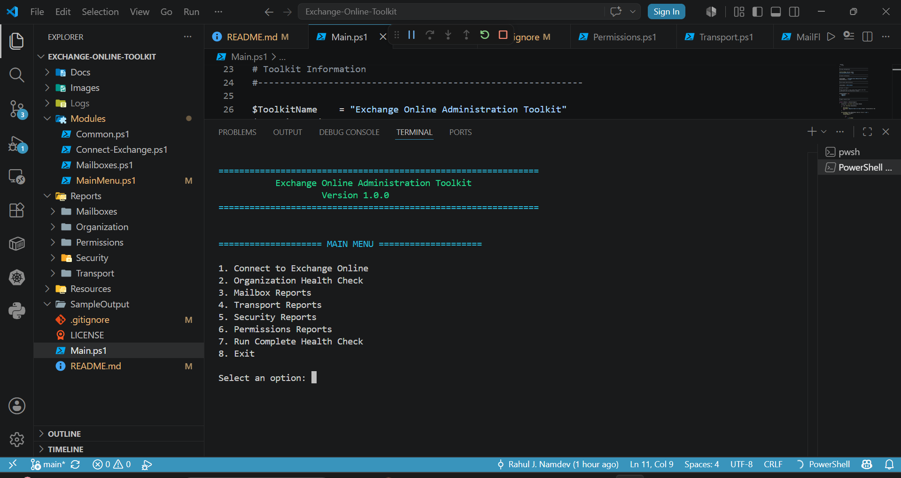
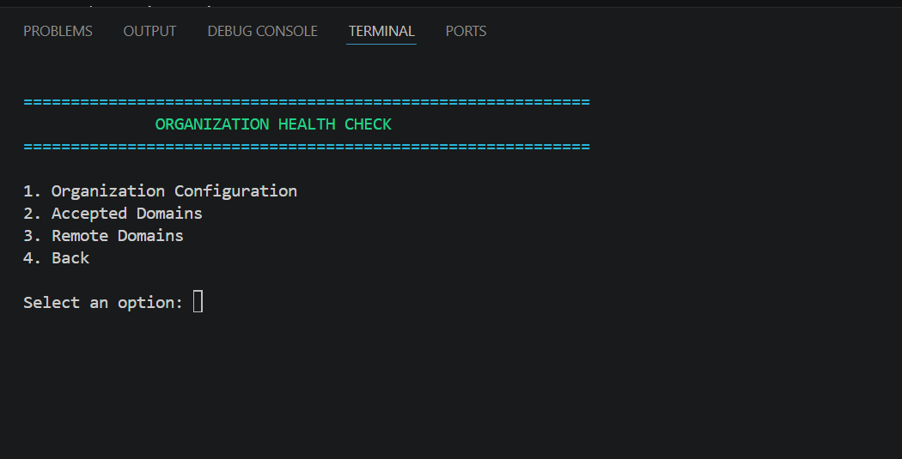
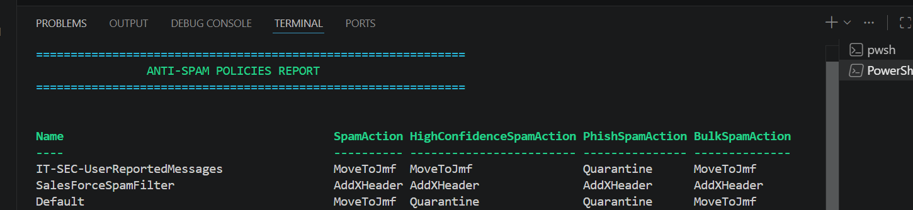
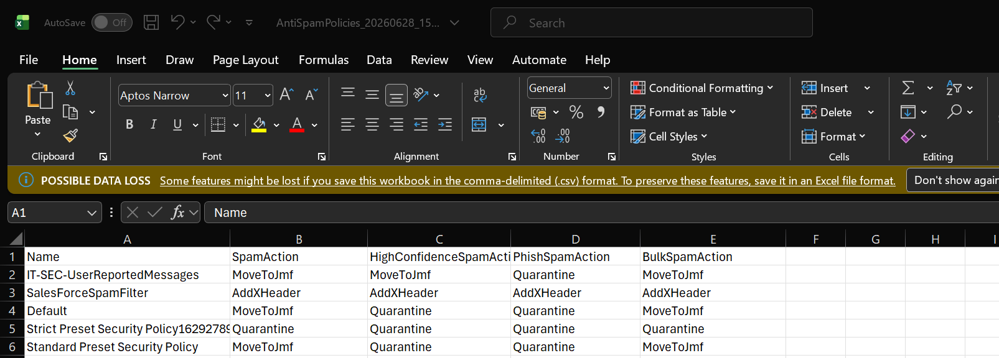
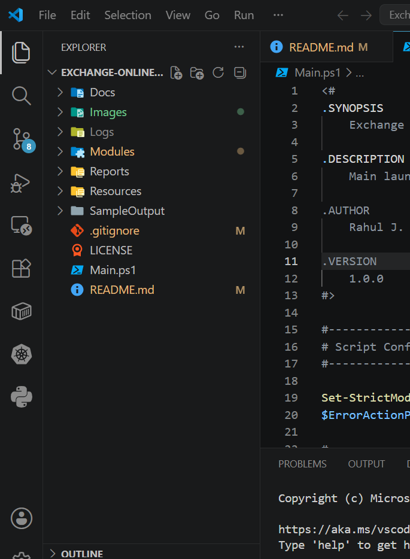

# Exchange Online Toolkit

> A modular PowerShell toolkit for Microsoft Exchange Online administration, reporting, and auditing.

---

## Overview

The **Exchange Online Toolkit** is an interactive PowerShell toolkit developed to simplify common Microsoft Exchange Online administrative tasks. It provides a menu-driven interface that allows administrators to collect configuration data, audit Exchange Online settings, and export reports in CSV format for documentation, troubleshooting, and operational reviews.

The project follows a modular architecture, making it easy to maintain and extend with additional reports in future releases.

---

## Features

### Organization Reports

* Organization Configuration
* Accepted Domains
* Remote Domains

### Mailbox Reports

* Mailbox Statistics
* Shared Mailboxes
* Room Mailboxes
* Mailbox Forwarding

### Permissions Reports

* Full Access Permissions
* Send As Permissions
* Send On Behalf Permissions
* Calendar Permissions

### Transport Reports

* Mail Flow Rules
* Transport Configuration

### Security Reports

* DKIM Configuration
* Anti-Spam Policies
* Anti-Phishing Policies
* Safe Links Policies
* Safe Attachments Policies

---

## Highlights

* Interactive menu-driven interface
* Modular PowerShell architecture
* Exchange Online connectivity
* CSV report export
* Consistent error handling
* Clean and organized project structure
* Easily extendable for future reports

---

## Project Structure

```text
Exchange-Online-Toolkit
│
├── Images
├── Logs
├── Modules
│   ├── Connect-Exchange.ps1
│   ├── Export.ps1
│   ├── MainMenu.ps1
│   └── ...
│
├── Reports
│   ├── Organization
│   ├── Mailboxes
│   ├── Permissions
│   ├── Transport
│   └── Security
│
├── Resources
├── SampleOutput
├── Main.ps1
├── README.md
└── LICENSE
```

---

## Prerequisites

Before running the toolkit, ensure you have:

* Windows PowerShell 5.1 or PowerShell 7+
* ExchangeOnlineManagement PowerShell Module
* Exchange Online Administrator permissions

Install the Exchange Online module:

```powershell
Install-Module ExchangeOnlineManagement -Scope CurrentUser
```

---

## Getting Started

Clone the repository:

```bash
git clone https://github.com/<your-github-username>/Exchange-Online-Toolkit.git
```

Navigate to the project directory:

```powershell
cd Exchange-Online-Toolkit
```

Run the toolkit:

```powershell
.\Main.ps1
```

Select **Connect to Exchange Online** from the main menu before running any reports.

---

## Reports Included

| Category     | Reports                                                                  |
| ------------ | ------------------------------------------------------------------------ |
| Organization | Organization Configuration, Accepted Domains, Remote Domains             |
| Mailboxes    | Mailbox Statistics, Shared Mailboxes, Room Mailboxes, Mailbox Forwarding |
| Permissions  | Full Access, Send As, Send On Behalf, Calendar Permissions               |
| Transport    | Mail Flow Rules, Transport Configuration                                 |
| Security     | DKIM, Anti-Spam, Anti-Phishing, Safe Links, Safe Attachments             |

---

## Screenshots

### Main Menu



### Organization Reports



### Mailbox Statistics


### Security Reports



### Sample Output



### Project Structure



---

## Sample Output

The toolkit exports reports in CSV format, making it easy to archive configuration data, perform audits, or share reports with other administrators.

Example output:

* OrganizationConfiguration.csv
* AcceptedDomains.csv
* MailboxStatistics.csv
* FullAccessPermissions.csv
* MailFlowRules.csv
* DKIMConfiguration.csv

---

## Future Enhancements

Planned improvements for future versions include:

* Complete Health Check mode
* HTML report generation
* Logging framework
* Additional Exchange Online reports
* Report filtering and search capabilities

---

## Author

**Rahul J. Namdev**

Senior Microsoft 365 Engineer

### Technical Skills

* Microsoft 365
* Exchange Online
* Microsoft Entra ID
* PowerShell
* SharePoint Online
* Microsoft Defender
* Microsoft Graph

If you find this project useful, feel free to star the repository or submit suggestions for future improvements.

---

## License

This project is licensed under the MIT License.
